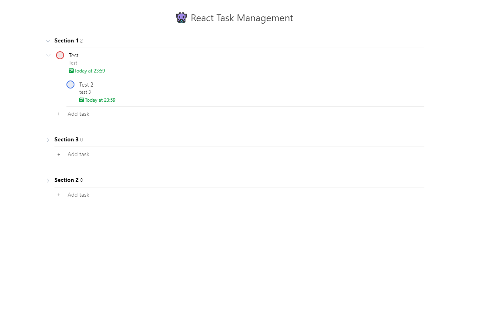

# React Task Management

This project is inspired by Todoist. Todoist seems simple on the outside but quite complicated on the inside.

## Features

- Add section and task to manage your tasks
- Choose 5 level of priority for your task for better management
- Collapsing sistem on task and section
- Support children task system
- All data and changes recorded on IndexedDB
- Drag and drop task on each section
- Set deadline on each task

## Tech Stack

- Vite + React
- Typescript
- Dnd-kit
- Tailwind
- Zustand

## Guide on Run Local

- Clone this repo
- Node used v20
- run `npm install`
- run `npm run dev`

